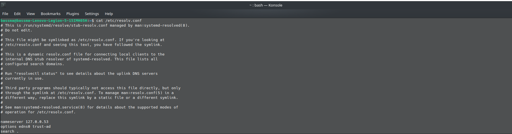
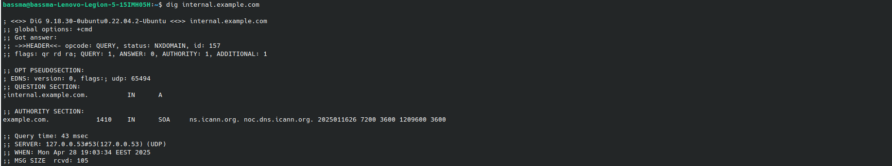
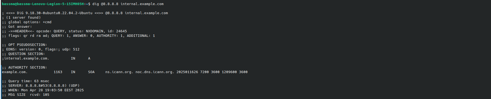
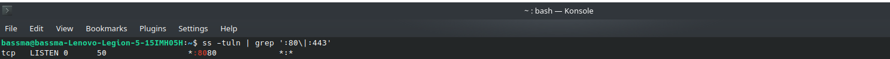

## DNS Resolution and Service Reachability Troubleshooting Guide


## 1- Verify DNS Resolution

The file /etc/resolv.conf lists the DNS servers used for resolving domain names. 
```bash
cat /etc/resolv.conf
```


**1.1** **Verify DNS Resolution of**
 ``` internal.example.com ```
```bash
dig internal.example.com
````


**1.2** **Compare with Google's DNS (8.8.8.8)** 
```bash
dig @8.8.8.8 internal.example.com
```


## 2- Diagnose Service Reachability

**2.1** **Confirm Service is Listening on the Expected Ports (80 or 443):** 
```bash
ss -tuln | grep ':80\|:443'
```

**2.2** **Test Service Accessibility using** ```curl``` 
- **for http port 80**
```bash
curl -I http://internal.example.com
```
- **for https port 443**

```bash
curl -I https://internal.example.com
```


## 3- Trace the Issue – List All Possible Causes

**1-** **DNS-related Causes**
- **No DNS Record Exists**

The domain internal.example.com has no corresponding A record in DNS.

as shown in dig output: NXDOMAIN.


**2-** **Network-related Causes**

- **Access to internal.example.com or ports 443/80 might be blocked by network firewall rules.**

**3-** **Service-related Causes**
- **Web Server Not Listening on 443/80**

    The web server might not actually be listening on standard ports (80/443).


## 4- Applied Fixes

**4.1** **Dns related causes**

We already confirmed this by running dig internal.example.com, which returned NXDOMAIN → meaning no DNS record found.


**a) First, gonna find out the correct private IP address of internal.example.com**

Suppose someone from the devops team gives me the ip: 192.168.1.10 or from internal documentation.

**b) Add the mapping manually into /etc/hosts**
```bash
sudo nano /etc/hosts
```
the actual IP    internal.example.com

**c) Verify the local DNS is now working**
```bash
dig internal.example.com
```

**4.2** **service related causes**

We already confirmed this by running ``ss -tuln | grep ':80\|:443' `` 
which returned nothing is listening on the mentioned ports


- **a) Set up a reverse proxy (using Nginx).**

- **b) Nginx listens on port 80 (standard HTTP).**

- **c) Nginx forwards requests to your internal dashboard running on port 80.**

**Create proxy config** 
```bash
sudo nano /etc/nginx/sites-available/internal-dashboard
```
pass this to config
```bash
server {
    listen 80;
    server_name internal.example.com;

    location / {
        proxy_pass http://127.0.0.1:8080;
        proxy_set_header Host $host;
        proxy_set_header X-Real-IP $remote_addr;
        proxy_set_header X-Forwarded-For $proxy_add_x_forwarded_for;
    }
}
```
```bash
sudo systemctl reload nginx
```
